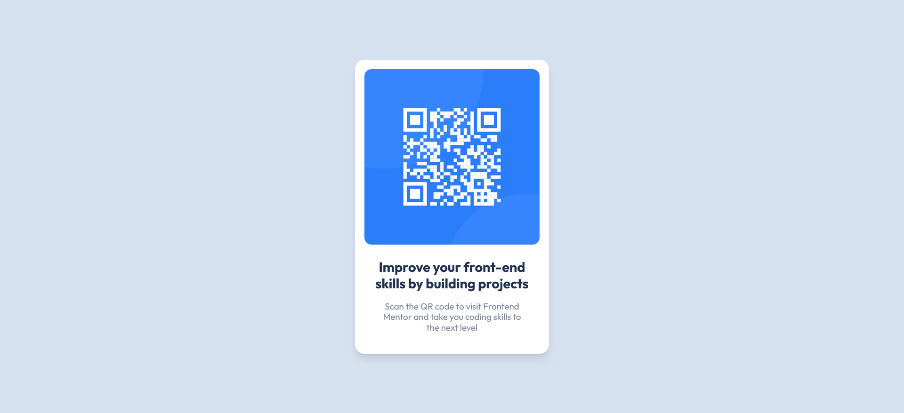

# Frontend Mentor - QR code component solution

This is a solution to the [QR code component challenge on Frontend Mentor](https://www.frontendmentor.io/challenges/qr-code-component-iux_sIO_H).

## Table of contents

- [Overview](#overview)
  - [Screenshot](#screenshot)
  - [Links](#links)
- [My process](#my-process)
  - [Built with](#built-with)
  - [What I learned](#what-i-learned)
  - [Useful resources](#useful-resources)
- [Author](#author)
- [Acknowledgments](#acknowledgments)

**Note: Delete this note and update the table of contents based on what sections you keep.**

## Overview

### Screenshot

### Links

- Solution URL: [Github](https://github.com/Ultimate48/qr-code-component-main)
- Live Site URL: [Live Site](https://qr-code-lzxq.onrender.com/)

## My process

### Built with

- Semantic HTML5 markup
- Tailwind CSS
- Flexbox
- Mobile-first workflow

### What I learned

It improved my knowledge of Tailwind CSS and how to set up different properties in tailwind.config.js and use them in the project

### Useful resources

- [HSL Wiki Page](https://en.wikipedia.org/wiki/HSL_and_HSV#:~:text=The%20HSL%20representation%20models%20the,paint%20corresponds%20to%20a%20high%20%22) - It helped me understand the HSL color scheme which I didn't have an understanding of before
- [Render](render.com) - Used to deply the live site

## Author

- Frontend Mentor - [Ultimate48](https://www.frontendmentor.io/profile/Ultimate48)
- Twitter - [@AdeeshGarg4](https://twitter.com/AdeeshGarg4)
